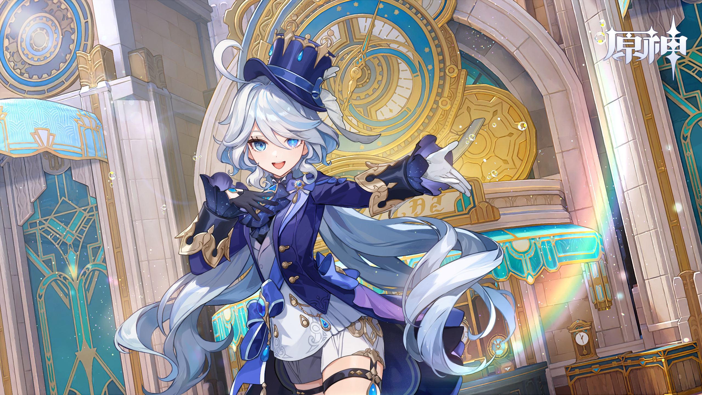

# Make-Sketch-dataset
* MAS
* makeing sketch dataset

## Install dependencies

```
# You can use the library already exists on the computer
# I will only remind you to install special libraries

# most important
git clone https://github.com/BachiLi/diffvg
git submodule update --init --recursive
cd diffvg
python setup.py install

# If you have completed the above steps, Victory is within grasp
```

## Clone the repo
```
git clone https://github.com/hankunbo/Make-Sketch-dataset.git
cd Make-Sketch-dataset
```
## download mask parameter 
```
#download mask parameter from
https://drive.google.com/uc?id=1ao1ovG1Qtx4b7EoskHXmi2E9rp5CHLcZ
#and put it under U2Net_/saved_models
```
## dataset
put your img pictures in dataset 

## train (make your own sketch dataset)
```
python main.py --img_paths dataset 
```
We provide some adjustable parameters for developers' convenience
```
--img_paths dataset
#Path to image folder
--batch_size 10
#Process how many images at once
--num_strokes 16
#The total number of lines used to fit it
--num_background 0
#The number of lines used to fit in the background
```

<p align="center">
   
</p>

